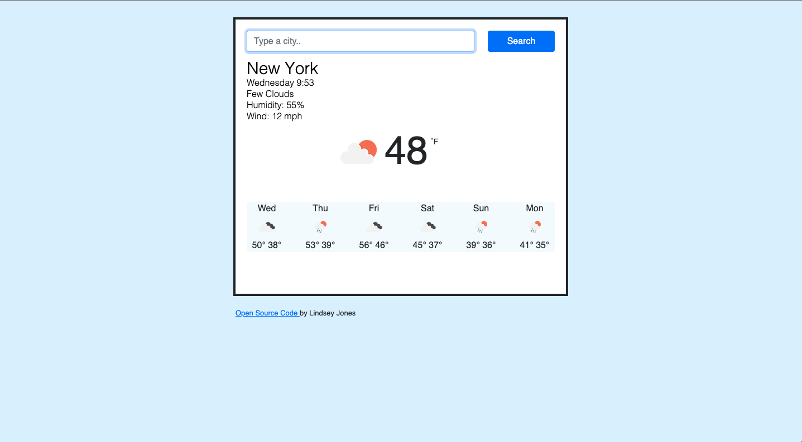

# Weather

## Description

This is a Weather App created with vanilla JavaScript.

---

| Table of Contents       |
| ----------------------- |
| [How to Use](#usage)    |
| [License](#license)     |
| [Credits](#credits)     |
| [Questions](#questions) |

---

## How to Use

Simply type in the name of the city whose weather you would like to see.

---

## License

    This project is under the following license: MIT.

---

## Credits

Created for SheCodes workshop.

---

## Questions?

| Contact Me                                   |
| -------------------------------------------- |
| [GitHub](https://www.github.com/L-Jones-hub) |
| [Email](lindseyjones92@gmail.com)            |

